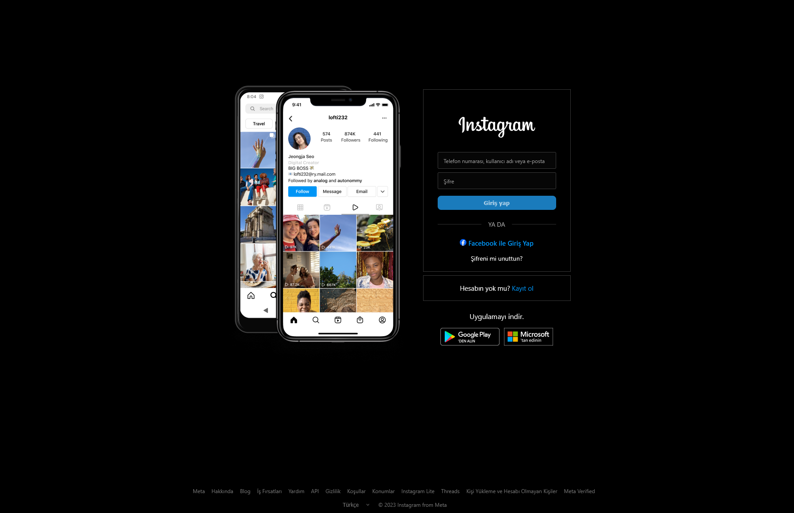

# Instagram Giriş Sayfası Klonu - HTML & CSS Pratik Projesi

Bu proje, HTML ve CSS becerilerimi geliştirmek amacıyla yapılmış bir Instagram giriş sayfası klonudur. Frontend geliştirme yeteneklerimi pekiştirmek ve modern CSS özelliklerini uygulamalı olarak öğrenmek için oluşturuldu takıldığım yerde yapayzekadan destek alarak yeni şeyler öğrendim.

[Instagram Clone Projesi Canlı Demo](https://igloginclone.vercel.app/)



## Projede Kullanılan ve Öğrenilen Teknikler

### 1. Floating Label (Yüzen Etiket) Tekniği
- İnput alanlarına tıklandığında veya değer girildiğinde label'ın yukarı kayması
- `:not(:placeholder-shown)` seçicisinin kullanımı
- Placeholder'ı gizleyip kendi özel label'ımı konumlandırma

```css
.form-control:not(:placeholder-shown) + .form-label {
  top: 3px;
  font-size: 9px;
  color: #ffffffb0;
}

.form-control::placeholder {
  color: transparent;
}
```

### 2. CSS ile Form Validasyonu
- HTML `required` ve `minlength` özelliklerini kullanma
- `:has()` seçicisi ile tüm inputların dolu olup olmadığını kontrol etme
- Form geçerli olduğunda buton rengini otomatik değiştirme

```css
form:has(.form-control:valid) .btn-login {
  background-color: #0095f6;
  color: white;
  cursor: pointer;
}
```

### 3. Divider (Ayırıcı) Oluşturma
- "YA DA" yazısını ortada tutan ve her iki yanında çizgi bulunan tasarım beni düşündürdü.
- Flexbox kullanarak yatay düzende çizgilerin otomatik genişlemesi

```css
.divider {
  display: flex;
  align-items: center;
}

.line {
  flex: 1;
  height: 1px;
  background-color: #99999952;
}
```

### 4. Konumlandırma Teknikleri
- `position: absolute` ve `position: relative` kullanımı
- Transform özellikleri ile öğeleri hassas konumlandırma
- Flex layout kullanarak sayfa yapısını oluşturma

### 5. Input Özellikleri
- Input'a focus olduğunda tarayıcının varsayılan mavi sınırını kaldırma
- `outline: none` ile varsayılan outline'ı kaldırma
- Input içindeki metni dikey olarak konumlandırma (padding-top ile)

```css
.form-control:focus {
  outline: none;
}

.form-control:not(:placeholder-shown) {
  padding-top: 10px;
}
```

## Öğrenilen İpuçları ve Püf Noktaları

- Border colors ve renk tonları için opacity değerleri kullanımı
- Renk geçişlerinde `transition` kullanımı
- Flexbox ile hızlı ve esnek sayfa düzenleri oluşturma
- Position absolute ve relative kullanarak hassas öğe konumlandırma
- Modern CSS selektörleri (`:has()`, `:not()`, `:placeholder-shown`)

---

Bu proje sayesinde, gerçek dünyada kullanılan modern web tasarım tekniklerini uygulamalı olarak öğrenme fırsatı buldum. Özellikle form elemanları üzerinde çalışmak ve CSS'in seçicileriyle kompleks etkileşimler oluşturmak hem keyif verdi hemde becerilerimi geliştirmemde büyük katkı sağladı.